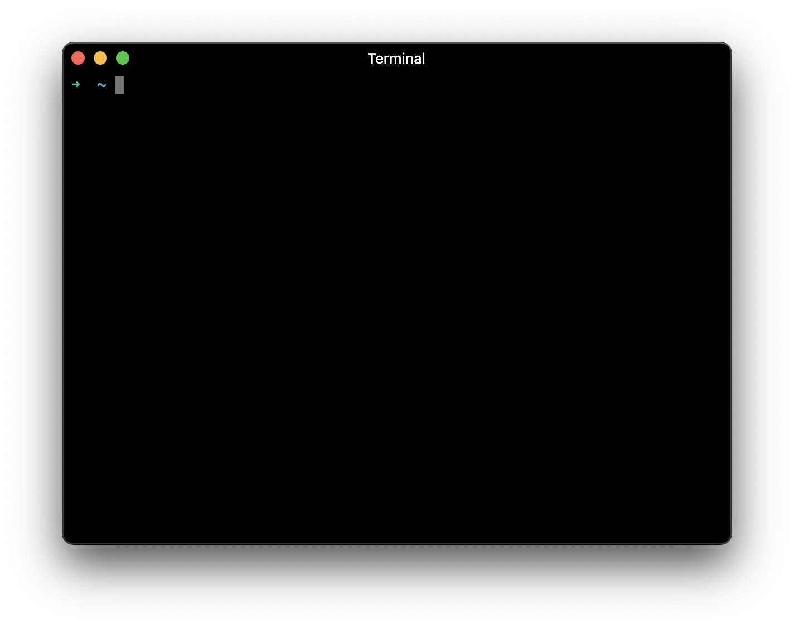

# Terminal

This is a simple yet customizable terminal emulator written in Flutter.

## Table of Contents

- [Screenshots](#screenshots)
- [Supported OSs](#supported-oss)
- [Features](#features)
- [Requirements](#requirements)
- [Installation](#installation)
- [Usage](#usage)
- [Build](#build)
- [Contributing](#contributing)
- [Credits](#credits)
- [Author](#author)

## Screenshots



## Supported OSs

- [x] macOS(zsh/bash)
- [x] Linux(zsh/bash)
- [x] Windows(cmd)

## Features

- [ ] oh-my-zsh support
- [ ] Terminal plugins
- [ ] Customizable
- [ ] Customizable key bindings
- [ ] Customizable themes
- [ ] Customizable fonts
- [ ] Customizable cursor
- [ ] Customizable shell
- [ ] Customizable shell arguments
- [ ] Customizable shell environment variables
- [ ] Customizable shell aliases

## Requirements

- [Flutter](https://flutter.dev/docs/get-started/install)
- [Visual Studio Code](https://code.visualstudio.com)
- [Visual Studio](https://visualstudio.microsoft.com)
- [Xcode](https://developer.apple.com/xcode)

## Installation

```bash
git clone https://github.com/mantreshkhurana/terminal.git
cd terminal
flutter pub get
```

## Usage

```bash
flutter run
```

## Build

Select platform like `macos`, `linux`, `windows` or `web`.

example: `flutter build macos`

```bash
flutter build <platform>
```

## Contributing

```bash
git clone https://github.com/<your-username>/terminal.git
cd terminal
git checkout -b <your-branch-name>
# after adding your changes
git add .
git commit -m "your commit message"
git push origin <your-branch-name>
```

## Credits

- [xterm](https://pub.dev/packages/xterm)
- [Flutter](https://flutter.dev)

## Author

- [Mantresh Khurana](https://github.com/mantreshkhurana)
