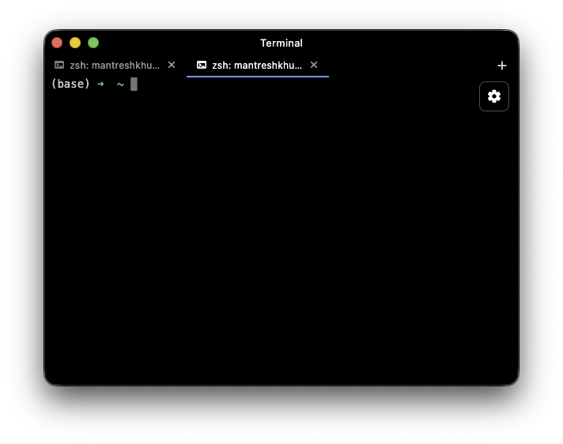

# Terminal

This is a simple yet customizable terminal emulator written in Flutter.

## Table of Contents

- [Screenshots](#screenshots)
- [Supported OSs](#supported-oss)
- [Features](#features)
- [Requirements](#requirements)
- [Installation](#installation)
- [Usage](#usage)
- [Build](#build)
- [Contributing](#contributing)
- [Credits](#credits)
- [Author](#author)

## Screenshots



## Supported OSs

- [x] macOS(zsh/bash)
- [x] Linux(zsh/bash)
- [x] Windows(cmd)

## Features

- [x] oh-my-zsh support
- [x] AI Implementation (Ollama/OpenAI/Gemini support with chat panel)
- [x] Customizable settings (hover over terminal to reveal settings icon)
- [x] Customizable key bindings
- [x] Customizable themes (Default Dark, Dracula, Solarized, Monokai, Nord, One Dark, Gruvbox)
- [x] Customizable fonts (size and family)
- [x] Customizable cursor (style: block/underline/bar, blink, color)
- [x] Customizable shell
- [x] Customizable shell arguments
- [x] Customizable shell environment variables
- [x] Customizable shell aliases
- [ ] Auto App Updater
- [ ] Terminal plugins
- [ ] Initial Text

## Requirements

- [Flutter](https://flutter.dev/docs/get-started/install)
- [Visual Studio Code](https://code.visualstudio.com)
- [Visual Studio](https://visualstudio.microsoft.com)
- [Xcode](https://developer.apple.com/xcode)

## Installation

```bash
git clone https://github.com/mantreshkhurana/terminal.git
cd terminal
flutter pub get
```

## Usage

```bash
flutter run
```

## Build

Select platform like `macos`, `linux`, `windows` or `web`.

example: `flutter build macos`

```bash
flutter build <platform>
```

## Plugins

It will only support plugins that are built specifically for this terminal emulator, [Mantresh Khurana](https://github.com/mantreshkhurana) is the only one who can verify and add your plugins to the official plugin list.
Plugins will be built in shell script and will be implemented in the terminal emulator using dart, docs for building plugins will be available soon.

## Contributing

```bash
git clone https://github.com/<your-username>/terminal.git
cd terminal
git checkout -b <your-branch-name>
# after adding your changes
git add .
git commit -m "your commit message"
git push origin <your-branch-name>
```

## Credits

- [xterm](https://pub.dev/packages/xterm)
- [Flutter](https://flutter.dev)

## Author

- [Mantresh Khurana](https://github.com/mantreshkhurana)
